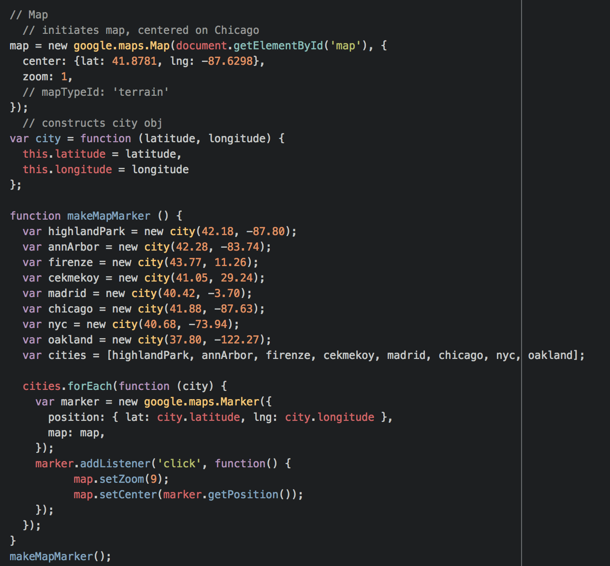
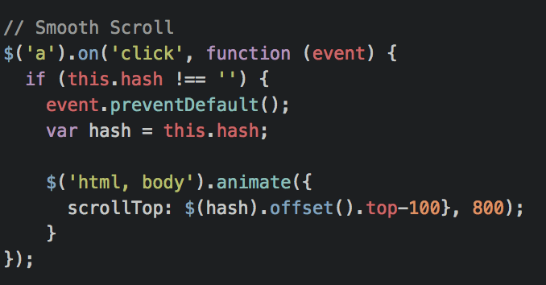

# project-0
This is my first Front-End solo dive!

#### Technologies Used
- HTML5
- CSS3
- JavaScript/jQuery

#### Downloaded Methods/scripts
- inView
- Slick

#### Process / Approach
- HTML Skeleton
- CSS3 Styling
- Finish skeleton
- Begin adding interactive features:
  - one section at a time
- Tweak for Responsiveness

#### Unsolved Problems 😤 💻 🗡 🗡 🗡 🗡
- NavBar highlighter
- Carousel loop

#### Big Wins
- Using google maps API

    

- Smooth Scroll

    

- Responsiveness
- Overall look and feel of the site

#### Sources
- staircase credit: https://jsfiddle.net/bya6p2oz/
- inView; https://github.com/camwiegert/in-view
- https://scotch.io/bar-talk/build-a-scroll-spy-navbar-solution-to-code-challenge-9
- carousel https://codepen.io/dobladov/pen/kXAXJx
- https://unsplash.com/
